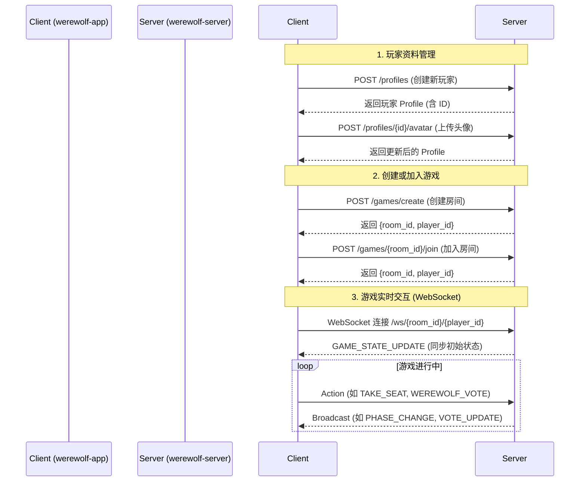

# Werewolf 游戏程序流程

本文档旨在阐述 Werewolf 应用的整体程序流程，涵盖前端与后端的交互、游戏状态的管理以及核心业务逻辑。

## 概览

本应用采用前后端分离架构：
- **`werewolf-app` (前端)**: 使用 Next.js 和 React 构建，负责用户界面和用户交互。
- **`werewolf-server` (后端)**: 使用 FastAPI (Python) 构建，负责处理游戏逻辑、数据存储和实时通信。

两者之间的通信主要通过两种方式：
1.  **HTTP REST API**: 用于无状态的请求，如创建/获取玩家资料、创建/加入游戏房间等。
2.  **WebSocket**: 用于游戏过程中的实时、有状态的通信，如玩家操作、游戏阶段变更、状态同步等。

---

## 详细流程

### 1. 启动与初始化

1.  **服务启动**: 通过 `docker-compose up` 同时启动前端和后端两个服务。
2.  **后端初始化**:
    - `main.py` 中的 FastAPI 应用启动。
    - `profile_manager.ensure_data_dirs()` 确保 `./data/players` 和 `./data/avatars` 目录存在，用于存储玩家数据和头像。
    - `game_manager` 以单例模式初始化，用于管理所有游戏房间的状态。
3.  **前端加载**:
    - 用户访问前端 URL，加载 Next.js 应用。
    - 应用会检查本地存储中是否存在玩家 Profile ID。如果不存在，会引导用户创建新的 Profile。

### 2. 玩家资料 (Profile) 管理

这是游戏的基础，每个玩家都需要一个唯一的身份标识。

1.  **创建 Profile**:
    - **前端**: 在 [`src/app/profile/page.tsx`](werewolf-app/src/app/profile/page.tsx:1) 中，用户输入昵称。
    - **API 调用**: 前端通过 [`src/lib/api.ts`](werewolf-app/src/lib/api.ts:1) 中的 `createProfile` 函数，向后端 `POST /profiles` 发送请求。
    - **后端**: [`main.py`](werewolf-server/main.py:37) 中的 `create_profile` 接口接收请求，调用 [`profile_manager.create_new_player`](werewolf-server/profile_manager.py:38) 函数。
    - **数据持久化**: `profile_manager` 会生成一个 UUID作为玩家 ID，并创建一个 JSON 文件（如 `data/players/uuid.json`）来存储玩家信息，包括姓名、ID 和初始统计数据。
2.  **上传头像**:
    - **前端**: 在 Profile 页面，用户可以选择并上传图片。
    - **API 调用**: 向后端 `POST /profiles/{player_id}/avatar` 发送图片文件。
    - **后端**: [`main.py`](werewolf-server/main.py:49) 中的 `upload_avatar` 接口处理文件上传，将其保存到 `data/avatars` 目录，并更新对应玩家 Profile JSON 文件中的 `avatar_url` 字段。

### 3. 游戏大厅与房间创建/加入

1.  **创建游戏房间**:
    - **前端**: 在 [`src/app/create-room/page.tsx`](werewolf-app/src/app/create-room/page.tsx:1) 中，房主选择游戏模板（板子）。
    - **API 调用**: 向后端 `POST /games/create` 发送请求，包含房主的 Profile ID 和所选的 `GameConfig`。
    - **后端**: [`main.py`](werewolf-server/main.py:102) 中的 `create_game` 接口调用 [`game_manager.create_game`](werewolf-server/game_manager.py:37)，在内存中创建一个新的 `Game` 实例，并以 `room_id` 为键存入 `games` 字典。房主被自动添加为第一个 `Player`。
    - **响应**: 后端返回 `room_id` 和房主的临时游戏内 `player_id`。前端页面跳转至 `/game/{room_id}`。
2.  **加入游戏房间**:
    - **前端**: 在 [`src/app/join-room/page.tsx`](werewolf-app/src/app/join-room/page.tsx:1) 中，页面首先调用 `GET /games` 获取当前所有处于 "lobby" 状态的房间列表并展示。
    - **API 调用**: 用户选择一个房间后，向后端 `POST /games/{room_id}/join` 发送请求。
    - **后端**: [`main.py`](werewolf-server/main.py:130) 中的 `join_game` 接口向指定 `Game` 实例的 `players` 列表中添加一个新的 `Player`。
    - **实时通知**: 后端通过 WebSocket 向该房间的所有已连接客户端广播 `PLAYER_JOINED` 消息，以便大厅内的其他玩家能看到新玩家的加入。

### 4. 核心游戏循环 (WebSocket)

当玩家进入游戏房间页面 (`/game/[roomId]`) 后，主要的交互都转为通过 WebSocket 进行。

1.  **建立连接**:
    - **前端**: [`src/app/game/[roomId]/page.tsx`](werewolf-app/src/app/game/[roomId]/page.tsx:1) 通过 [`WebSocketContext`](werewolf-app/src/lib/WebSocketContext.tsx:1) 与后端建立 WebSocket 连接，URL 为 `/ws/{room_id}/{player_id}`。
    - **后端**: [`main.py`](werewolf-server/main.py:166) 中的 `websocket_endpoint` 接收连接请求。它使用 [`connection_manager`](werewolf-server/connections.py:1) 注册连接，并立即发送一次 `GAME_STATE_UPDATE` 消息，将当前完整的游戏状态同步给刚连接的客户端。
2.  **游戏准备 (Lobby Phase)**:
    - 玩家可以发送 `TAKE_SEAT` 动作来选择座位。
    - 房主客户端可以发送 `START_GAME` 动作。
3.  **游戏开始**:
    - **后端**: [`ws_actions.py`](werewolf-server/ws_actions.py:42) 中的 `handle_start_game` 调用 [`game_manager.start_game`](werewolf-server/game_manager.py:74)。
    - **角色分配**: `game_manager` 根据游戏模板中的角色配置，为所有玩家随机分配角色 (`player.role`)。
    - **状态变更**:
        - 游戏状态 `game.phase` 从 "lobby" 切换到夜晚的第一个阶段 (如 "werewolf_turn")。
        - 向所有玩家广播 `GAME_START` 消息，包含公开的游戏状态。
        - 向每个玩家单独发送 `ROLE_ASSIGNMENT` 消息，告知其被分配的角色。
        - 调用 `game_loop` 启动第一个游戏阶段。
4.  **游戏阶段驱动**:
    - **`game_manager.game_loop`**: 这是游戏的核心驱动函数。它根据当前的 `game.phase`，从 `PHASE_HANDLERS` 字典中查找并执行对应的处理函数（如 `handle_werewolf_turn`）。
    - **阶段处理函数**: 每个阶段的处理函数负责：
        a.  广播 `PHASE_CHANGE` 消息，通知所有客户端进入新阶段，并告知阶段时长。
        b.  向需要操作的特定角色（如狼人、预言家）发送专属的操作面板消息（如 `WEREWOLF_PANEL`），其中包含可操作的玩家列表等信息。
        c.  启动一个 `phase_timer` 计时器。如果计时器结束时玩家仍未完成操作，会自动推进到下一阶段。
    - **玩家操作**: 玩家在前端界面上进行操作（如投票、查验），前端将操作封装成一个 Action (如 `WEREWOLF_VOTE`) 发送给后端。
    - **动作处理**: [`ws_actions.py`](werewolf-server/ws_actions.py:1) 中的 `handle_ws_action` 接收动作，调用相应的处理函数（如 `handle_werewolf_vote`）来更新内存中的 `Game` 状态。
    - **阶段推进**: 当一个阶段的条件满足时（例如，所有狼人都投了票，或者预言家已查验），会调用 `game_manager.advance_game_phase`。此函数会根据预设的 `PHASE_ORDER` 列表，将游戏切换到下一个有效的阶段（会跳过已出局或不存在的角色的阶段），并再次调用 `game_loop`，形成循环。
5.  **日夜交替**:
    - **夜晚**: 按照 `PHASE_ORDER` 顺序执行狼人、女巫、预言家等角色的回合。
    - **白天**:
        - `process_night_results`: 计算夜晚的行动结果（如谁被杀了）。
        - 宣布死讯，进入发言、投票等阶段。
        - `process_day_votes`: 计算白天的投票结果，决定谁被放逐。
6.  **游戏结束**:
    - 在每次 `advance_game_phase` 之前，会调用 `check_game_over` 检查游戏是否满足结束条件（例如，所有狼人出局，或所有神/民出局）。
    - 如果游戏结束，会广播 `GAME_OVER` 消息，并调用 `update_player_stats` 更新所有参与玩家的个人战绩。

---

## 关键模块职责

- **[`main.py`](werewolf-server/main.py:1)**: API 入口，定义所有 HTTP 和 WebSocket 端点。
- **[`game_manager.py`](werewolf-server/game_manager.py:1)**: 核心状态机。管理所有游戏房间的生命周期和阶段转换。不直接处理网络请求。
- **[`ws_actions.py`](werewolf-server/ws_actions.py:1)**: WebSocket 动作处理器。解析来自客户端的指令，并调用 `game_manager` 中的相应方法来改变游戏状态。
- **[`connections.py`](werewolf-server/connections.py:1)**: WebSocket 连接管理器。维护一个从 `room_id` 到玩家连接的映射，负责消息的广播和单点发送。
- **[`models.py`](werewolf-server/models.py:1)**: 数据模型定义。使用 Pydantic 定义了如 `Game`, `Player`, `Role`, `GameTemplate` 等所有核心数据结构。
- **[`profile_manager.py`](werewolf-server/profile_manager.py:1)**: 玩家资料管理器。负责玩家数据的读写，与文件系统交互。
- **[`game_logic.py`](werewolf-server/game_logic.py:1)**: 存放纯粹的游戏逻辑函数，例如计票算法 `process_day_votes`。
- **[`api.ts`](werewolf-app/src/lib/api.ts:1)**: 前端 API 层。封装了所有对后端 HTTP 接口的请求。
- **[`WebSocketContext.tsx`](werewolf-app/src/lib/WebSocketContext.tsx:1)**: 前端 WebSocket 管理。提供一个 React Context 来维护 WebSocket 连接，并处理消息的收发。